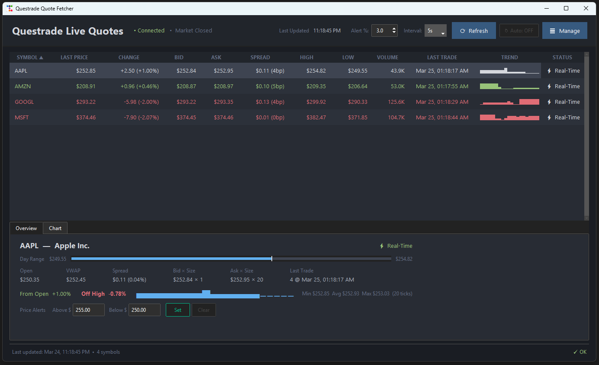

# Questrade Quote Fetcher

Real-time security prices from the Questrade API, with both CLI and GUI interfaces.



## Watchlist

Edit `symbols.json` in the project root to add or remove securities:

```json
[
  { "symbol": "AAPL",  "exchange": "NASDAQ", "name": "Apple Inc." },
  { "symbol": "AMZN",  "exchange": "NASDAQ", "name": "Amazon.com Inc." },
  { "symbol": "GOOGL", "exchange": "NASDAQ", "name": "Alphabet Inc." },
  { "symbol": "MSFT",  "exchange": "NASDAQ", "name": "Microsoft Corporation" }
]
```

For TSX-listed securities, add the `.TO` suffix (e.g. `FIE.TO`).

## Setup

```bash
python -m venv .venv
```

| Shell      | Activate                        |
|------------|---------------------------------|
| bash       | `source .venv/bin/activate`     |
| PowerShell | `.venv\Scripts\Activate.ps1`    |
| cmd        | `.venv\Scripts\activate.bat`    |

```bash
pip install -r requirements.txt
cp .env.example .env   # then add your QUESTRADE_REFRESH_TOKEN
```

## Usage

| Command                        | Description                |
|--------------------------------|----------------------------|
| `python -m questrade.main`     | Fetch quotes (CLI)         |
| `python -m questrade --gui`    | Launch GUI window          |

The GUI includes a refresh button and an auto-refresh toggle (10s interval).

## Development

```bash
pytest                   # Run tests
pytest --cov=src         # Run with coverage
ruff check src tests     # Lint
mypy src                 # Type check
```

## Authentication

Questrade uses OAuth 2.0 with short-lived access tokens (30 min) and long-lived refresh tokens. Store your initial refresh token in `.env` — the app rotates it automatically after each refresh.

<details>
<summary>Troubleshooting</summary>

| Error | Fix |
|-------|-----|
| `ModuleNotFoundError: questrade` | Activate the venv, or set `PYTHONPATH=src` |
| `ValidationError` on bid/ask | Markets are closed — `None` values are expected |
| `SymbolNotFoundError` for TSX symbols | Use the `.TO` suffix (e.g. `FIE.TO`) |

</details>

## Resources

- [Questrade API Documentation](https://www.questrade.com/api/documentation/getting-started)
